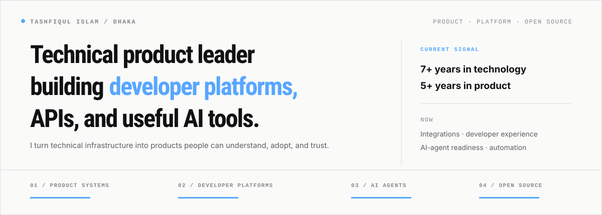
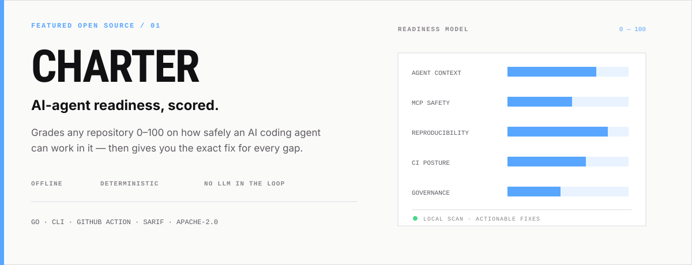
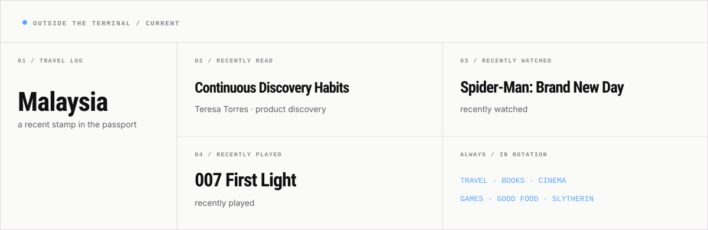

<h1 align="center">Hi 👋 — I’m Tashfiq.</h1>

<picture>
  <source media="(max-width: 600px) and (prefers-color-scheme: dark)" srcset="./assets/profile-hero-mobile-dark.svg">
  <source media="(max-width: 600px) and (prefers-color-scheme: light)" srcset="./assets/profile-hero-mobile-light.svg">
  <source media="(prefers-color-scheme: dark)" srcset="./assets/profile-hero-dark.svg">
  <source media="(prefers-color-scheme: light)" srcset="./assets/profile-hero-light.svg">
  
</picture>

  
  
  
  
  

  

---

## `01 / NOW`

I work where product strategy meets technical infrastructure: **APIs, integrations, developer experience, and the systems that help other people build**.

 

At [Field Nation](https://github.com/fieldnation), I lead product for integrations and the [developer platform](https://developer.fieldnation.com/). Outside work, I build open-source tools and explore coding-agent readiness, MCP safety, and useful automation.

`PRODUCT SYSTEMS` · `DEVELOPER PLATFORMS` · `AI AGENTS` · `OPEN SOURCE`

---

## `02 / FEATURED OPEN SOURCE`

<a href="https://github.com/use-charter/charter">
  <picture>
    <source media="(max-width: 600px) and (prefers-color-scheme: dark)" srcset="./assets/charter-spotlight-mobile-dark.svg">
    <source media="(max-width: 600px) and (prefers-color-scheme: light)" srcset="./assets/charter-spotlight-mobile-light.svg">
    <source media="(prefers-color-scheme: dark)" srcset="./assets/charter-spotlight-dark.svg">
    <source media="(prefers-color-scheme: light)" srcset="./assets/charter-spotlight-light.svg">
    
  </picture>
</a>

  <strong><a href="https://github.com/use-charter/charter">Explore Charter →</a></strong>
  &nbsp;·&nbsp; <a href="https://use-charter.dev">Website</a>
  &nbsp;·&nbsp; <a href="https://github.com/marketplace/actions/charter-ai-agent-readiness">GitHub Marketplace</a>
  &nbsp;·&nbsp; <a href="https://use-charter.dev/rules">Rule catalog</a>

---

## `03 / SELECTED BUILDS`

### [Profile View Counter](https://github.com/tashfiqul-islam/profile-view-counter) `EDGE / TYPESCRIPT`

An edge-deployed GitHub profile counter built with Cloudflare Workers, D1, KV, and Hono. The live counter at the top of this page is the product itself.

 

### [Profile Weather View](https://github.com/tashfiqul-islam/profile-weather-view) `AUTOMATION / BUN`

A TypeScript and Bun workflow that writes current weather into a GitHub profile automatically, without requiring an API key.

 

### [Bengali Text Summarizer](https://github.com/tashfiqul-islam/bengali-text-summarizer-website) `NLP / NEXT.JS`

A web application for summarizing Bengali news articles, connecting language-focused machine learning with a modern web interface. [Open the live app →](https://bengali-text-summarizer-website.vercel.app)

 

### [Dhaka Metro Station Finder](https://github.com/tashfiqul-islam/metro-station-finder) `MAPS / NEXT.JS`

A practical location tool for finding the nearest metro station in Dhaka and understanding the distance from a searched destination. [Open the live app →](https://tashfiqul-islam.github.io/metro-station-finder/)

---

## `04 / BUILDING IN PUBLIC`

<strong>AT A GLANCE</strong>

  <picture>
    <source media="(prefers-color-scheme: dark)" srcset="https://github-profile-summary-cards.vercel.app/api/cards/stats?username=tashfiqul-islam&amp;theme=github_dark">
    <source media="(prefers-color-scheme: light)" srcset="https://github-profile-summary-cards.vercel.app/api/cards/stats?username=tashfiqul-islam&amp;theme=github">
    
  </picture>
  <picture>
    <source media="(prefers-color-scheme: dark)" srcset="https://github-profile-summary-cards.vercel.app/api/cards/most-commit-language?username=tashfiqul-islam&amp;theme=github_dark">
    <source media="(prefers-color-scheme: light)" srcset="https://github-profile-summary-cards.vercel.app/api/cards/most-commit-language?username=tashfiqul-islam&amp;theme=github">
    
  </picture>

<strong>THE FULL PICTURE</strong>

<picture>
  <source media="(prefers-color-scheme: dark)" srcset="https://github-profile-summary-cards.vercel.app/api/cards/profile-details?username=tashfiqul-islam&amp;theme=github_dark">
  <source media="(prefers-color-scheme: light)" srcset="https://github-profile-summary-cards.vercel.app/api/cards/profile-details?username=tashfiqul-islam&amp;theme=github">
  
</picture>

---

## `05 / LIVE AUTOMATION`

Current conditions from Dhaka, written into this README by a tool I built.

 

<!-- Dhaka's weather table -->
<h3 align="center">🌦️ Live from Dhaka</h3>

  

<table align="center">
  <tr>
    <th>Weather</th>
    <th>Temperature</th>
    <th>Sunrise</th>
    <th>Sunset</th>
    <th>Humidity</th>
  </tr>
  <tr>
    <!-- Hourly Weather Update -->
        <td align="center">Overcast </td>
        <td align="center">31°C</td>
        <td align="center">05:37</td>
        <td align="center">18:24</td>
        <td align="center">72%</td>
    <!-- End of Hourly Weather Update -->
  </tr>
</table>

<em>Last refresh: Monday, August 24, 2026 at 11:58:20 (UTC+6)</em>

<!-- End of Dhaka's weather table -->

---

## `06 / OUTSIDE THE TERMINAL`

<picture>
  <source media="(max-width: 600px) and (prefers-color-scheme: dark)" srcset="./assets/life-lately-mobile-dark.svg">
  <source media="(max-width: 600px) and (prefers-color-scheme: light)" srcset="./assets/life-lately-mobile-light.svg">
  <source media="(prefers-color-scheme: dark)" srcset="./assets/life-lately-dark.svg">
  <source media="(prefers-color-scheme: light)" srcset="./assets/life-lately-light.svg">
  
</picture>

---

  <strong>BUILDING USEFUL THINGS · LEARNING IN PUBLIC</strong>
  <h2>Making complex systems feel clear.</h2>
  
Developer platforms, APIs, open source, or practical AI-agent tooling?

  
<strong><a href="mailto:tashfiq61@gmail.com">Email me →</a></strong> &nbsp;·&nbsp; <a href="https://www.linkedin.com/in/tashfiqulislam/">LinkedIn</a> &nbsp;·&nbsp; <a href="https://github.com/tashfiqul-islam?tab=repositories">Explore my repositories</a>

